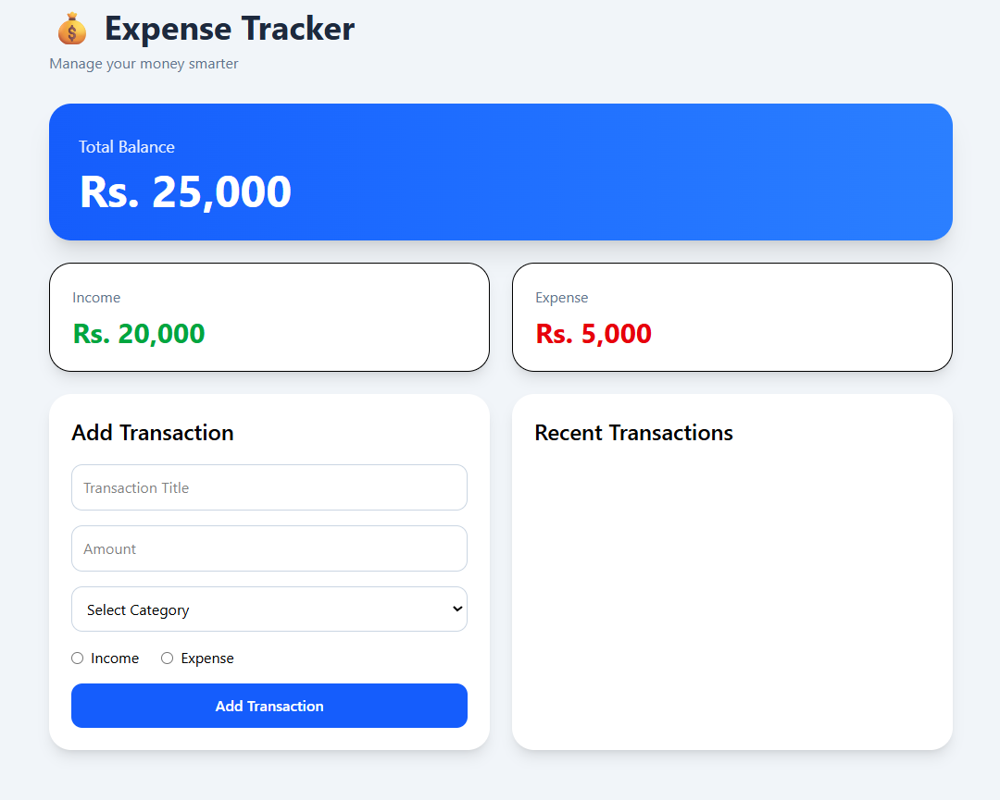

# 💰 Expense Tracker App

A simple and interactive Expense Tracker built using **HTML, CSS (Tailwind), and Vanilla JavaScript**.  
This project helps users manage income, expenses, and balance with real-time updates and persistent storage.

---

## 🚀 Live Demo

👉 https://expense-tracker-32.vercel.app/

---

## 📷 Preview



---

## 🚀 Features

- ➕ Add income and expense transactions
- 🗑️ Delete transactions
- 📊 Real-time balance calculation
- 💵 Separate income and expense tracking
- 💾 Data persistence using localStorage
- 🔄 Automatic UI updates after every action
- 🧹 Clear form after adding transaction

---

## 🧠 What I Learned

- DOM manipulation in JavaScript
- Event handling
- CRUD operations (Create, Read, Delete)
- Array methods (`push`, `splice`, `forEach`)
- State management using arrays
- localStorage for data persistence
- Clean UI update pattern using `updateUI()`

---

## ⚙️ How It Works

```text
User Input → Transaction Object → Array Storage → localStorage → UI Render → Balance Calculation


🛠️ Tech Stack
- HTML
- Tailwind CSS
- JavaScript (Vanilla)


📁 Project Structure
/index.html
/script.js
/style.css
/screenshot.png


Future Improvements
✏️ Edit transaction feature
📊 Filter by income/expense
🎨 Improved UI design
📱 Mobile responsiveness improvements


👨‍💻 Author

Built by Sagar Joshi while learning JavaScript and frontend development.